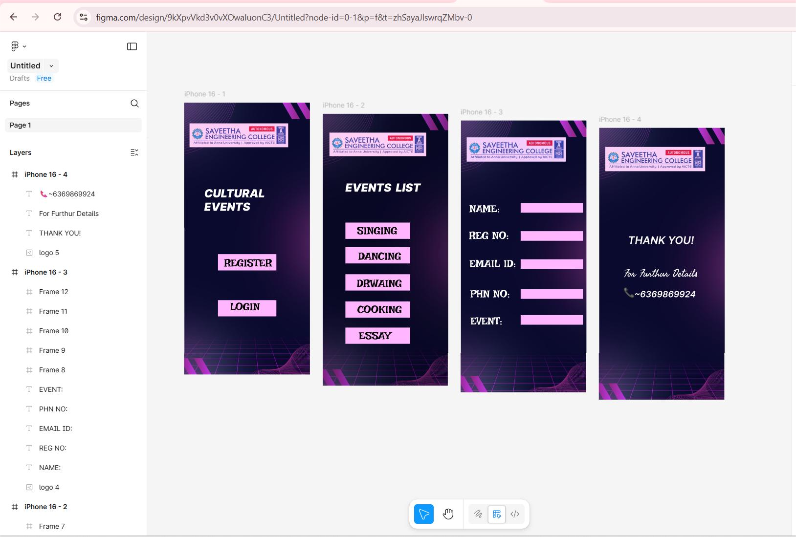

# Ex09 Event Registration Web Application
## Date:20.11.2025

## AIM:
To design, develop and deploy a web application for event registration.

## DESIGN STEPS:

### Step 1:
Create a new frame.

### Step 2:
Select any one preset size of your choice.

### Step 3:
Select the shapes you need.

### Step 4:
Import images as needed.

### Step 5:
Create pages based on your need and link them.

### Step 6:

Validate the HTML and CSS code.

### Step 6:

Publish the website in the given URL.

## DESIGN TOOL:
Figma

## CODE:
home page
```
<!DOCTYPE html>
<html>
  <head>
    <meta name="viewport" content="width=device-width, initial-scale=1" />
    <meta charset="utf-8" />
    <link rel="stylesheet" href="globals.css" />
    <link rel="stylesheet" href="style.css" />
  </head>
  <body>
    <div class="iphone">
      
      <div class="CULTURAL-EVENTS">
        CULTURAL&nbsp;&nbsp;&nbsp;&nbsp;&nbsp;&nbsp;&nbsp;&nbsp;&nbsp;&nbsp;&nbsp;&nbsp;&nbsp;&nbsp;EVENTS
      </div>
      <div class="frame"></div>
      <div class="div"></div>
      <div class="text-wrapper">REGISTER</div>
      <div class="LOGIN">&nbsp;&nbsp;&nbsp;&nbsp;LOGIN</div>
    </div>
  </body>
</html>
```
event page
```
<!DOCTYPE html>
<html>
  <head>
    <meta name="viewport" content="width=device-width, initial-scale=1" />
    <meta charset="utf-8" />
    <link rel="stylesheet" href="globals.css" />
    <link rel="stylesheet" href="style.css" />
  </head>
  <body>
    <div class="iphone">
      
      <div class="EVENTS-LIST">&nbsp;&nbsp;&nbsp;&nbsp;&nbsp;&nbsp;EVENTS&nbsp;&nbsp;LIST</div>
      <div class="frame"><div class="SINGING">&nbsp;&nbsp; SINGING</div></div>
      <div class="DANCING-wrapper"><div class="DANCING">&nbsp;&nbsp; DANCING</div></div>
      <div class="div-wrapper"><div class="DRWAING">&nbsp;&nbsp;DRWAING</div></div>
      <div class="div-wrapper"><div class="COOKING">&nbsp;&nbsp;COOKING</div></div>
      <div class="ESSAY-wrapper"><div class="ESSAY">&nbsp;&nbsp; ESSAY</div></div>
    </div>
  </body>
</html>
```
registration page
```
<!DOCTYPE html>
<html>
  <head>
    <meta name="viewport" content="width=device-width, initial-scale=1" />
    <meta charset="utf-8" />
    <link rel="stylesheet" href="globals.css" />
    <link rel="stylesheet" href="style.css" />
  </head>
  <body>
    <div class="iphone">
      
      <div class="text-wrapper">NAME:</div>
      <div class="div">REG NO:</div>
      <div class="text-wrapper-2">EMAIL ID:</div>
      <div class="text-wrapper-3">PHN NO:</div>
      <div class="text-wrapper-4">EVENT:</div>
      <div class="frame"></div>
      <div class="frame-2"></div>
      <div class="frame-3"></div>
      <div class="frame-4"></div>
      <div class="frame-5"></div>
    </div>
  </body>
</html>
```
contact page
```
<!DOCTYPE html>
<html>
  <head>
    <meta name="viewport" content="width=device-width, initial-scale=1" />
    <meta charset="utf-8" />
    <link rel="stylesheet" href="globals.css" />
    <link rel="stylesheet" href="style.css" />
  </head>
  <body>
    <div class="iphone">
      
      <div class="text-wrapper">THANK YOU!</div>
      <div class="div">For Furthur Details</div>
      <p class="element"><span class="span">📞</span> <span class="text-wrapper-2">~6369869924</span></p>
    </div>
  </body>
</html>
```

## OUTPUT:


## RESULT:
The program to design, develop and deploy a web application for event registration is completed successfully.
